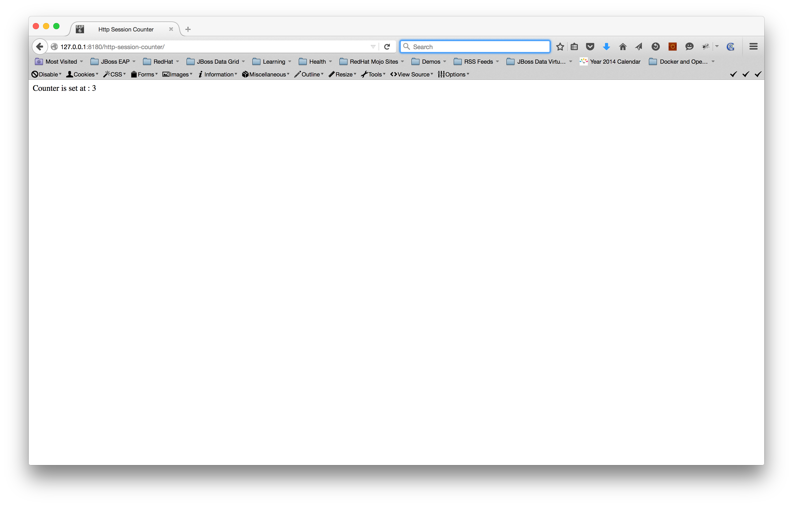
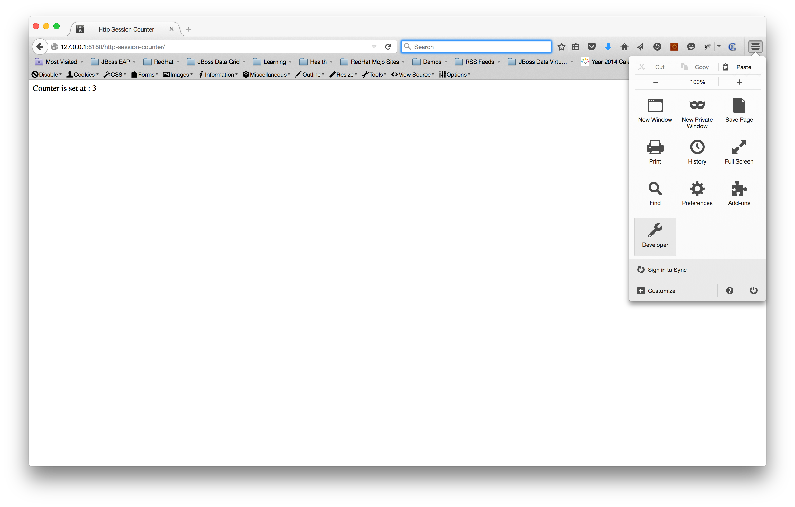
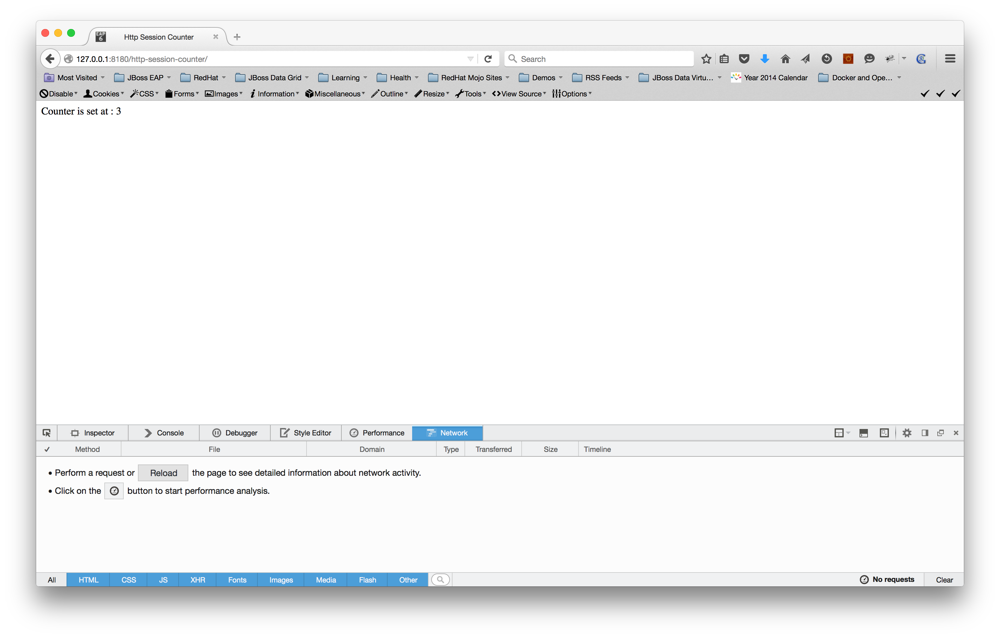
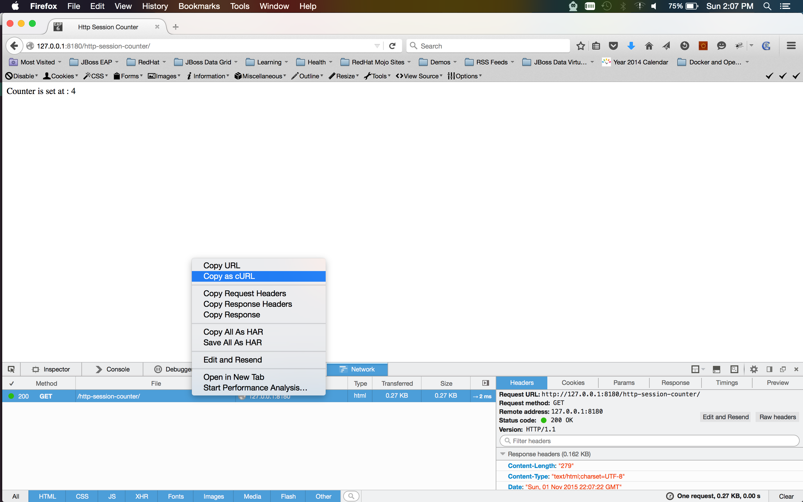

# Externalizing HTTP Sessions to remote JDG Servers

## Prerequisites

* Java JDK installed with `JAVA_HOME` set and `java` on the $PATH
* JBoss EAP 7.\* 
* JBoss Data Grid 7.\* (server)
* Firefox or Safari with developer tools to snoop on HTTP traffic

## Setup 

### Build the project 

Run the following command in the root folder of the project 

```sh 
mvn clean package
```

### Setup runtime environments

Open up a shell in the root folder of the project and run the following commands

```sh 
# Provide correct paths to the EAP and JDG server runtimes
export EAP_HOME=<path-to-eap-home-folder>
export JDG_HOME=<path-to-jdg-home-folder>

# Run the provided setup script
. scripts/setup.sh
```
After the script has run successfully, the EAP nodes can be accessed at:

1. Node 1 : http://127.0.0.1:8180/http-session-counter/
2. Node 2 : http://127.0.0.1:8280/http-session-counter/ 

## Test

1. Hit the first EAP host URL couple of times via browser [](.images/http-request-node1.png)
2. As shown in the image(s) below navigate to Menu -> Developer -> Network -> Reload [](.images/developer-tools.png) [](.images/network.png)
3. As shown in the image below, right click on the **HTTP GET** request and select **Copy as cURL** [](.images/cURL.png) 
4. Open a new shell and run the captured cURL. You will see that the session continues via shell as well [](.images/cURL-node1.png)
5. Modify the cURL and point the command to the second EAP host. You will notice that the session continues on second EAP because of session replication. [](.images/cURL-node2.png)
6. Shutdown EAP Node 1 and Node 2 and start both of them back again 
7. Run the same cURL as in steps 4 and 5. You will notice that the session continues from where it was last left off 
